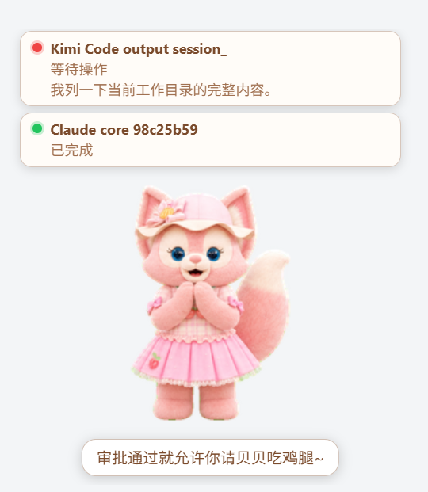

<div align="center">

# MultiAgents Manager

**Unified Management Platform for Multi-Agent Programming Tools**

A desktop app to monitor, notify, jump to, and manage Claude Code / Codex CLI / OpenCode / OpenClaw / Kimi Code / WorkBuddy sessions

[](LICENSE)
[](https://v2.tauri.app/)
[](https://react.dev/)

English · [中文](README.md)

</div>

---

## Features

### Session Monitoring Dashboard

Real-time traffic-light status board for all active AI coding tool sessions.

| Status | Meaning |
|--------|---------|
| 🔴 Red | Waiting for user input |
| 🟡 Yellow | Processing / Thinking |
| 🟢 Green | Idle / Finished |

- Auto-discovers running **Claude Code**, **Codex CLI/APP**, **OpenCode**, **OpenClaw**, **Kimi Code**, and **WorkBuddy** sessions
- Distinguishes CLI vs. desktop APP form: APP sessions support session-level deep-link jumps (`workbuddy://chat/<id>`, `codex://threads/<id>`, with APP-foreground fallback) and persistent unread cards (kept across restarts, cleared when the host exits)
- Shows project name, git branch, last message preview, CPU usage, runtime
- Sorts by priority: waiting → running → idle
- System tray icon reflects aggregate status (🔴/🟡/🟢)

### Foxbell Desktop Pet

A talking fox companion that lives in the corner of your screen and watches every session in real time.



- Status cards above the pet mirror the dashboard: 🔴 waiting / 🟡 running / 🟢 finished — click a card to jump to its terminal
- Voice alerts (31 built-in clips): playful nudges on waiting approvals, cheers on completion, small talk on double-click, subtitles synced to audio length
- Drag physics: pinned-to-cursor dragging, gravity fall on release, throw inertia, squash-and-bounce landing (optional)
- Single-click waves, double-click talks, right-click menu: sound / subtitles / physics / always-on-top / size / per-scene action binding / hide
- Dashboard integration: takes over completion chimes, suppresses toast popups while always-on-top; toggle from the dashboard 🦊 button, system tray, or settings

#### External Pets

Since v0.3.0 the pet format is open — Foxbell is no longer the only companion:

- **Import custom pets**: from a local zip / directory, or download from the Petdex online repository; manifest structure, frame rate, dimensions and voice manifests are fully validated
- **Manage panel**: import / edit description / rename / delete / one-click hot swap — no app restart needed; the active pet is auto-restored after deletion or switching
- **Capability gating**: pets without voices gracefully degrade to animation-only (transient actions kept); voice capabilities stay in two-way sync

### Desktop Notifications & Sound Alerts

- Color-change-based notifications (red↔yellow↔green) with deduplication
- Web Audio API chimes — no audio files needed
- Configurable on/off toggle in settings
- Clickable notifications with "View Session" action to jump to terminal

### Quick Terminal Jump

Click a session card to instantly focus the corresponding terminal tab:

| Terminal | Support |
|----------|---------|
| iTerm2 | ✅ AppleScript |
| Terminal.app | ✅ AppleScript |
| tmux | ✅ pane selection + terminal focus |
| Wayland | ❌ Graceful fallback message |

Desktop APP tools (Codex APP, WorkBuddy) support session-level deep-link jumps: `codex://threads/<id>`, `workbuddy://chat/<id>`. The handler is verified before dispatch and foregrounding is verified after; on failure it falls back to APP-level focus (macOS AppleScript / Windows nearest-ancestor) without marking the session read.

### Extension Resource Management

Unified repository for Skills, MCP servers, and Plugins across tools:

- **Skills**: Symlink (Unix) / Junction (Windows) mapping to each tool's skill directory
- **MCP Servers**: Auto-format conversion — JSON (Claude / Kimi) / TOML (Codex) / JSONC (OpenCode)
- **Plugins**: File/config hybrid management
- Auto-import existing skills on first launch (from `~/.claude/skills/`, `~/.agents/skills/`, `~/.config/opencode/skills/`)
- Rescan button for discovering newly installed skills

### Preset Groups

Bundle Skills + MCP servers + Plugins into named presets and apply/deactivate in one click:

- One-click apply to any tool — auto-adapts to each tool's config format
- Partial success handling: reports failures without rolling back successful items
- Conflict detection: skips already-existing resources
- System tray menu integration for quick switching

### Sub-Agent Resource Allocation

For multi-agent tools (Hermes, OpenCode, etc.), allocate resource subsets to sub-agents:

- Sub-agent allocation is constrained to the tool-level enabled range
- Tool-level disable cascades down to all sub-agents

### Tool Toggle Management

A dedicated settings section to decide which tools MAM monitors and manages:

- Row-style toggle list: icon + name + installed badge; changes are staged locally and batch-saved, with a confirmation dialog listing restore/rollback items and an unsaved-changes leave guard
- Unchecking = full restore: symlinks become real files, MCP entries are removed from tool configs, unread cards are cleared; the SSOT repository and DB assignments are kept, and re-checking rebuilds everything per the original assignments (partial failures auto-rollback — re-saving retries idempotently)
- Unchecked tools are fully hidden: session scanning skips them, notifications are muted, resource/preset UIs hide them, and guarded commands return structured, localized errors

---

## Tech Stack

| Layer | Technology |
|-------|-----------|
| Desktop Framework | [Tauri v2](https://v2.tauri.app/) (Rust) |
| Frontend | [React 19](https://react.dev/) + [TypeScript](https://www.typescriptlang.org/) |
| UI Components | [shadcn/ui](https://ui.shadcn.com/) (Radix UI) |
| Styling | [Tailwind CSS v4](https://tailwindcss.com/) |
| State Management | [Zustand](https://zustand-demo.pmnd.rs/) |
| i18n | [i18next](https://www.i18next.com/) (Chinese / English) |
| Database | [SQLite](https://www.sqlite.org/) (via [rusqlite](https://github.com/rusqlite/rusqlite)) |
| Process Monitoring | [sysinfo](https://github.com/GuillaumeGomez/sysinfo) |

## Architecture

```
src-tauri/src/
├── adapter/           # Agent adapter trait + per-tool implementations
│   ├── claude.rs      #   Claude Code (JSONL + Hook)
│   ├── codex.rs       #   Codex CLI/APP (JSONL + Hook)
│   ├── opencode.rs    #   OpenCode (SQLite)
│   ├── openclaw.rs    #   OpenClaw (state.json)
│   ├── kimi.rs        #   Kimi Code (session_index + wire.jsonl)
│   └── mod.rs         #   AgentAdapter trait + tool registry + session discovery scheduler
├── monitor/
│   ├── process.rs     #   Process discovery (sysinfo scan)
│   ├── claude_parser.rs   # Claude parser (message.role protocol)
│   ├── codex_parser.rs    # Codex parser (rollout JSONL protocol)
│   ├── opencode_parser.rs # OpenCode SQLite parser
│   ├── openclaw_parser.rs # OpenClaw state.json parser
│   ├── kimi_parser.rs     # Kimi Code parser (session_index + wire.jsonl)
│   ├── jsonl.rs       #   Shared JSONL reading (tail read, file enumeration)
│   ├── cwd.rs         #   cwd normalization (process ↔ session matching)
│   ├── git.rs         #   GitHub URL lookup (in-process cache)
│   ├── path_codec.rs  #   Claude projects dir-name codec
│   ├── project.rs     #   Project name extraction + cwd shape validation
│   ├── status.rs      #   Pure-message status determination
│   └── hooks.rs       #   Hook registration + event file reader
├── services/          #   Business services split by domain
│   ├── skill/         #   Skill install/enable/disable + auto-import
│   ├── resource/      #   Resource scan, SSOT import, link sync
│   ├── mcp/           #   MCP config writer (JSON/TOML/JSONC)
│   ├── preset/        #   Preset apply/deactivate + compatibility check
│   ├── plugin/        #   Plugin management
│   └── manifest/      #   Extension manifest validation + update check
├── linker/
│   ├── mod.rs         #   Symlink/Junction management + security checks
│   ├── detector.rs    #   Tool installation detection
│   ├── layer2.rs      #   Layer 2 tool-level active directory
│   └── layer3.rs      #   Layer 3 sub-agent-level active directory
├── commands/          #   Tauri IPC commands split by module
├── database/          #   SQLite data layer (schema/migration/dao)
├── session/           #   Session model + status enum
├── window/            #   Terminal focus (iTerm2 / Terminal.app / tmux)
├── plugins/
│   └── system_tray.rs #   System tray with status + preset menu
└── lib.rs             #   App entry + plugin registration

src/
├── pages/             #   Home / Settings / About
├── components/
│   ├── SessionCard.tsx #   Session card with status light
│   ├── SessionGrid.tsx #   Dashboard grid
│   ├── ExtensionList.tsx # Dual-view (byKind/byTool) resource management
│   ├── ResourceByKindView.tsx # Skills/MCP/Plugins three-section view
│   ├── ResourceByToolView.tsx # Four-tool card view
│   ├── ImportDialog.tsx  #   Native resource scan & import
│   ├── CompatibilityDialog.tsx # Preset compatibility check
│   ├── PresetList.tsx  #   Preset group CRUD
│   └── ui/            #   shadcn/ui primitives
├── hooks/             #   useSessions, useNotification, useUpdater
├── stores/            #   Zustand session store
├── lib/               #   Audio, shortcut, updater, window utils
├── i18n/              #   Chinese + English locales
└── types/             #   TypeScript type definitions
```

---

## Getting Started

### Prerequisites

- [Node.js](https://nodejs.org/) ≥ 18
- [pnpm](https://pnpm.io/) ≥ 8
- [Rust](https://www.rust-lang.org/tools/install) ≥ 1.77
- [Tauri v2 CLI](https://v2.tauri.app/start/prerequisites/)

### Install & Run

```bash
# Clone the repository
git clone https://github.com/jarvislee90s-dot/MultiAgents-Manager.git
cd MultiAgents-Manager

# Install frontend dependencies
pnpm install

# Start development mode
pnpm tauri:dev
```

### Build

```bash
# Build release binary (Windows NSIS installer)
pnpm tauri:build
```

### Lint & Format

```bash
pnpm check        # format:check + lint + build
pnpm format       # auto-format with Prettier
pnpm lint         # ESLint check
pnpm lint:fix     # ESLint auto-fix
```

---

## Configuration

The app stores its data in `~/.mam/`:

| Path | Purpose |
|------|---------|
| `~/.mam/mam.db` | SQLite database (settings, extensions, presets, session cache) |
| `~/.mam/skills/` | Global skill repository |
| `~/.mam/mcp/` | Global MCP server configs |
| `~/.mam/hooks/status-hook.sh` | Shared Hook script for status events |
| `~/.mam/events/` | Hook event files (auto-cleaned, 30s TTL) |

### Supported Tool Configs

| Tool | Skill Directory | MCP Config | MCP Format | Hook Support |
|------|----------------|------------|------------|-------------|
| Claude Code | `~/.claude/skills/` | `~/.claude.json` | JSON | ✅ (PascalCase) |
| Codex CLI | `~/.agents/skills/` | `~/.codex/config.toml` | TOML | ✅ (camelCase) |
| OpenCode | `~/.config/opencode/skills/` | `~/.config/opencode/opencode.json` | JSONC | ❌ |
| OpenClaw | `~/.openclaw/skills/` | N/A | N/A | ❌ |
| Kimi Code | `~/.kimi-code/skills/` | `~/.kimi-code/mcp.json` | JSON | ❌ (status parsed from wire) |
| WorkBuddy | `~/.workbuddy/skills/` | `~/.workbuddy/mcp.json` | JSON | ❌ (status derived from heartbeat + JSONL) |

---

## Roadmap

- [x] US1 — Multi-tool session monitoring dashboard
- [x] US2 — Status change notifications & sound alerts
- [x] US3 — Quick terminal jump (iTerm2/Terminal.app/tmux)
- [x] US4 — Skill/MCP/Plugin unified repository management
- [x] US5 — Preset group one-click switching
- [x] US6 — Sub-agent level resource allocation
- [x] Resource dashboard redesign (dual-view + import + compatibility)
- [x] OpenClaw support (4th tool)
- [x] Kimi Code support (5th tool: session monitoring + MCP management + `KIMI_CODE_HOME` data directory redirection)
- [x] WorkBuddy support (6th tool: heartbeat-driven monitoring + deep-link jumps + resource management)
- [x] Foxbell desktop pet (status cards + voice alerts + drag physics)
- [x] External pets (local/Petdex import + manage panel hot swap + capability gating)
- [x] Tool toggle management (batch save + restore/rebuild + full hiding)
- [x] APP-form session cards and deep-link jumps
- [x] Plugin management (file/config hybrid)
- [x] i18n (Chinese + English)
- [x] Auto-update via GitHub Releases
- [x] Dark/light theme sync with system
- [x] Windows support (NSIS installer + deep links + nearest-ancestor window focus)
- [ ] Linux support
- [ ] Kitty & WezTerm terminal jump support

---

## Contributing

Contributions are welcome! Please feel free to submit a Pull Request.

1. Fork the repository
2. Create your feature branch (`git checkout -b feature/amazing-feature`)
3. Commit your changes (`git commit -m 'feat: add amazing feature'`)
4. Push to the branch (`git push origin feature/amazing-feature`)
5. Open a Pull Request

Please read [AGENTS.md](AGENTS.md) for project architecture and development guidelines.

---

## License

This project is licensed under the MIT License — see the [LICENSE](LICENSE) file for details.
