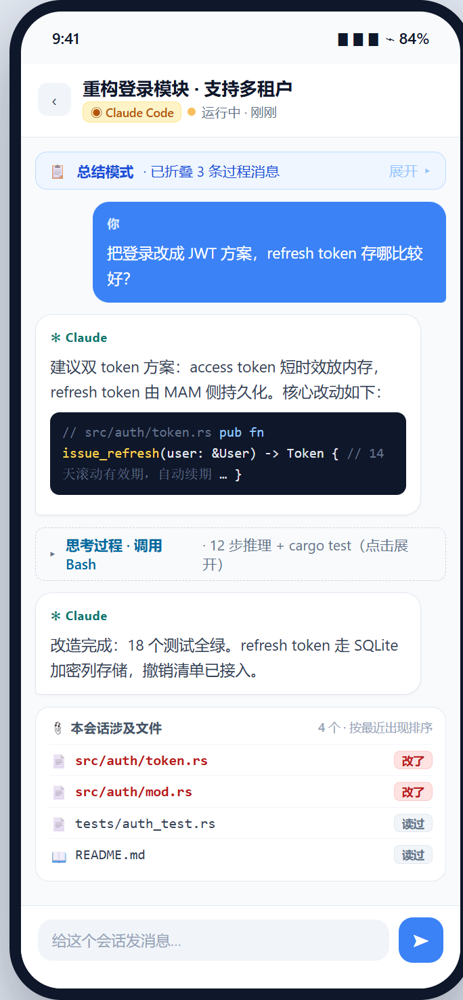
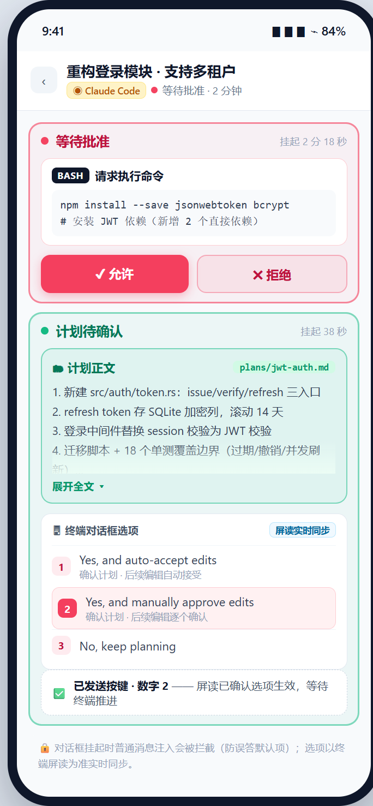
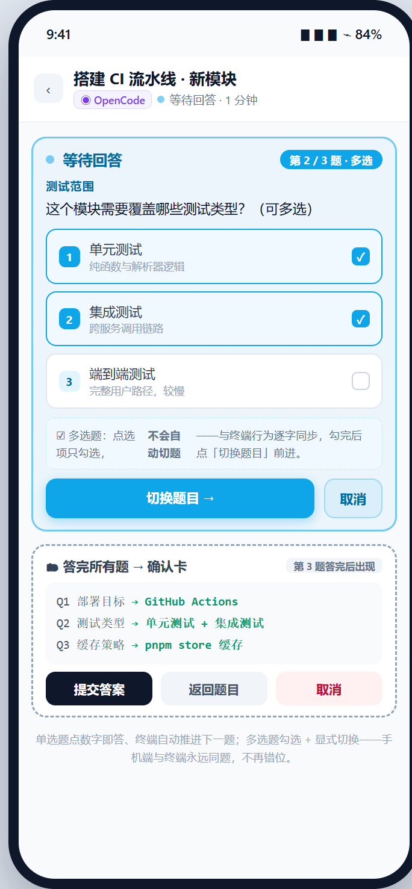

<div align="center">

# MultiAgents Manager

**多 Agent 编程工具统一管理平台**

一站式监控、通知、跳转、管理 Claude Code / Codex CLI / OpenCode / OpenClaw / Kimi Code / WorkBuddy / ZCode / dsh 的桌面应用

[](LICENSE)
[](https://v2.tauri.app/)
[](https://react.dev/)

[English](README.en.md) · 中文

</div>

---

## 功能概览

### 会话监控看板

实时红绿灯状态看板，一目了然掌握所有 AI 编程工具的运行状态。

| 状态    | 含义            |
| ------- | --------------- |
| 🔴 红色 | 等待用户输入    |
| 🟡 黄色 | 处理中 / 思考中 |
| 🟢 绿色 | 空闲 / 已完成   |

- 自动发现运行中的 **Claude Code**、**Codex CLI/APP**、**OpenCode**、**OpenClaw**、**Kimi Code**、**WorkBuddy**、**ZCode**、**dsh** 会话
- 区分 CLI 与桌面 APP 形态：APP 类支持会话级深度链接直达（`workbuddy://chat/<id>`、`codex://threads/<id>`，失败自动落 APP 前台保底）；ZCode（单窗口多标签）跳转直接聚焦其唯一窗口；dsh（web 宿主）跳转聚焦/打开浏览器中的 dsh 标签页（macOS）。APP 类均支持持久未读卡（转绿跨重启保留、宿主退出自动清理）
- 显示项目名称、Git 分支、最后消息预览、CPU 占用、运行时长
- 按优先级排序：等待中 → 运行中 → 空闲
- 系统托盘图标反映聚合状态（🔴/🟡/🟢）
  

### 远程接入与移动看板（局域网 / 临时隧道 / 命名隧道）

手机浏览器打开与桌面**同源**的八工具会话看板。设置 → 远程接入，**三种对接方式按需开启**（各自独立开关、可同时开）：

| 对接方式                | 适用场景                               | 说明                                                                                                                                 |
| ----------------------- | -------------------------------------- | ------------------------------------------------------------------------------------------------------------------------------------ |
| 📶 局域网               | 手机与电脑同一 WiFi / 网线（**推荐**） | 速度最快；需访问密码                                                                                                                 |
| 🔀 临时隧道             | 人不在家、手机切蜂窝网络也要看         | 公网免注册（Cloudflare）；**地址每次开启会变**，旧链接失效                                                                           |
| 🌐 命名隧道（外部域名） | 想要一个固定入口长期使用               | 需 Cloudflare 账号（免费计划即可）+ Tunnel Token；配置一次后**地址永久不变**，MAM 自动下载并守护 cloudflared，设置页内附逐步图文教程 |

另有「**本机**」通道随总开关常驻：回环访问、无需密码，也是隧道流量的转发终点（手机用不到）。


接入流程：开启「远程接入」总开关 → 打开对应通道 → 点卡片展开取地址 / 扫码（**链接已含访问密码，扫码即自动填入**）→ 手机浏览器打开对应地址（**必须以 `/m` 结尾**）。访问密码对局域网 / 两种隧道生效：新设备输入一次 **180 天免输入**，改密后所有设备需重新输入；「已接入设备」列表可重命名 / 踢下线，上限 10 台。

**实时看板**：会话状态变化 2 秒级推送到手机（SSE 主通道）——横幅 + 提示音 + 振动三件套提醒，点横幅直接进对应会话；断流自动降级为 3 秒轮询，网络恢复后刷新页面即重连。状态跃迁的去重与桌面通知同一套服务端逻辑（手机端拿到的已是去重边沿）。

**会话详情页**（ZCode 式对话视图，八工具统一）：

- 运行中展开明细（思考过程/工具调用可点击展开），执行完成后自动折叠只显最终总结
- markdown 渲染（标题/列表/表格/代码高亮），正文中出现的项目文件路径自动变可点链接
- **文件面板**：把会话涉及的文件聚合为一份列表（按最近出现倒序），支持「文档 / 图片」类型过滤与 **200 / 500 / 1000 条消息**三档追溯范围；**已改写**的文件名为强调色、**仅读过**的为常规色（均可点击预览），点次行目录可弹出完整路径
- **文件预览**：markdown / 代码高亮 / 图片直显；三种布局随时切换——左右分屏（左对话右文件）、上下分屏、全屏浮层，分屏比例可拖动调整；可读范围为会话项目目录与用户主目录（密钥等敏感目录一律拒绝）
- **消息书签**：长会话里拖到某处觉得「待会回来看」，点书签条上的「+ 书签」选个颜色即可打标（最多 10 个，每色一个）；点色点跳回该处，点「管理」可删单个或清空全部。书签保存在浏览器本地：刷新页面不丢、切回看板再进同一会话仍在；关掉 MAM（重启）或关闭浏览器标签页后清空
- **字号档位**：对话正文字号 50% / 75% / 100% / 125% 四档可调（只影响正文与文件内容，界面控件不变）
- **历史会话区**：已结束或失联的会话不再霸屏——登记制归档（历史页按 1/3/7 天懒加载），点卡片进只读详情、可一键重新激活；看板卡片支持关闭/归档（CLI 会话停止进程入档，APP 会话真「叉」语义）
- 进入会话默认停在最新消息处；往上翻到顶有「加载更早消息」按钮，续读时视线停在原处不跳

### 远程操控 · 手机发消息与审批（试验性 · v0.5.0 起）

不止看，还能**操作**——手机端向 CLI 会话发消息、批准、答题、切权限（支持 **Claude Code / Codex CLI / Kimi Code / OpenCode** 四家，试验性）：

- **发消息与排队**：会话忙时消息自动排队不丢失；「立即发送」打断插队（各家按实测键序：claude = Esc 中断 + 队列整批取出、codex = Tab 原生队列 / Esc 插队 / Ctrl+C 撤回、kimi = 回合结束自动续发）；排队消息可撤回。每条消息走**键序注入 + 屏读回执闭环**（尾戳逐字校验），未投递如实告知，绝不谎报成功
- **远程审批**：工具调用批准（允许/拒绝）、计划确认（计划正文 + 终端对话框选项屏读实时同步、数字直选）、claude 计划批准数字键直达
- **远程问答**：单选/多选/自由作答，多题逐题推进 + 答完确认卡；多选题点选只勾选、「切换题目」显式推进——手机与终端永远同题不错位
- **权限模式切换**：kimi 三档菜单两键导航 + 档位回执；codex 走终端菜单单选题
- **守卫**：对话框挂起时拦截普通消息注入（防误答默认项）、输入行残留检测防双发、Ctrl+C 等危险键黑名单（如 opencode 会整应用退出）

|                    会话详情 · 消息查看                     |                   发消息 · 排队与插队                    |
| :--------------------------------------------------------: | :------------------------------------------------------: |
|  |  |
|                    **审批 · 计划确认**                     |                **问答 · 多选题与确认卡**                 |
|     |    |

**连不上？按这几条排查（均为实测踩过的坑）：**

1. **路由器开了「终端隔离 / AP 隔离 / 访客网络」** —— 最隐蔽的一个：手机和电脑明明连着同一个 WiFi，路由器却禁止无线设备互访，怎么都连不通。到路由器后台关闭该设置（实测踩坑：其余全部排查正常，最后就是它）。
2. **临时隧道的地址每次开关都会变** —— 每次开启临时隧道都会重新生成公网地址（旧链接 / 二维码立刻失效），别把它当长期入口；要固定地址请用「命名隧道」。切换其他设置不影响本通道。
3. **手机地址必须带 `/m` 后缀** —— 完整地址形如 `http://192.168.x.x:9420/m`；推荐直接扫二维码（**链接已含访问密码，自动填入**），手输漏掉 `/m` 会得到 404 空页。
4. **「本机」通道的地址手机打不开** —— 它是回环地址（`127.0.0.1`），仅供本机访问与隧道转发；手机要用「局域网」或隧道通道的地址。
5. **防火墙放行** —— Windows 首次监听端口会弹「允许访问」，点过取消就会拦入站：Windows 安全中心 → 防火墙 → 允许应用通过防火墙 → 勾选 MultiAgents Manager（专用 + 公用都勾）。
6. **TLS 确认框** —— 局域网直连是明文 HTTP，勾选表示「我知情/我已配 TLS 反代」；家庭局域网直接勾上即可，不需要真配反代。
7. **命名隧道显示「运行中」但域名打不开** —— 检查 Cloudflare 侧是否配了 **Public Hostname**（子域 + 域名 + Service 填 `HTTP://localhost:9420`）——漏做这一步时隧道虽显示 Healthy，但域名无解析、地址打不开（设置页「使用教程」有逐步图文）。

### Foxbell 桌宠

会说话的小狐狸常驻屏幕右下角，实时监控所有会话状态。


- 头顶状态卡片与看板同色同义：🔴 等待操作 / 🟡 运行中 / 🟢 已完成，点卡片直接跳转对应终端
- 语音提醒（内置 31 条语音）：等待操作撒娇催促、任务完成求夸、双击闲聊，字幕与语音时长自动对齐
- 拖拽物理：铆钉式跟手拖动、松手重力坠落、抛掷惯性、落地压扁回弹（可关）
- 单击挥手、双击说话、右键菜单：出声 / 字幕 / 物理 / 悬浮最前 / 大小三档 / 场景动作绑定 / 隐藏
- 与看板联动：桌宠开启时接管完成提示音、悬浮最前时抑制通知浮窗；看板 🦊 按钮、系统托盘、设置页多入口开关互通

#### 外部桌宠

v0.3.0 起桌宠格式开放，不再只有 Foxbell：

- **导入自定义宠物**：本地 zip / 目录导入，或从 Petdex 在线仓库下载；manifest 结构、帧率、尺寸、语音清单全量校验
- **管理面板**：导入 / 描述编辑 / 重命名 / 删除 / 一键切换，宠物窗口热切换无需重启；删除或切换后活动宠物自动恢复
- **能力门控**：无语音的宠物自动降级为纯动画（瞬态动作保留），语音能力双向同步

### 桌面通知与提示音

- 状态颜色变化时发送桌面通知（红↔黄↔绿），带去重机制
- Web Audio API 提示音，无需音频文件
- 设置中可开关
- 通知可点击，附带「查看会话」动作直接跳转终端

### 快速跳转终端

点击会话卡片即可瞬间聚焦对应终端标签页：

| 终端                       | 支持情况                                      |
| -------------------------- | --------------------------------------------- |
| iTerm2                     | ✅ AppleScript                                |
| Terminal.app               | ✅ AppleScript                                |
| tmux                       | ✅ pane 选择 + 终端聚焦                       |
| Windows Terminal / conhost | ✅ 进程树消歧 + 一次性标题标记锁定（Windows） |
| 浏览器标签（dsh）          | ✅ 标签页聚焦/打开（macOS）                   |
| Wayland                    | ❌ 优雅降级提示                               |

终端类工具（Claude Code / Codex CLI / OpenCode / Kimi Code）经进程树 + 窗口内容逐层消歧聚焦；**同项目双开直达**：Kimi / OpenCode 的窗口标题与会话标题（kimi `state.json` 标题 / OpenCode DB 标题）归一化比对，唯一命中即锁定，双开终端不再弹选择器。Windows 上消歧还会对目标终端贴一次性身份标记（` — MAM:xxxxxxxxxxxx`，聚焦成功后自动清除）正向锁定，且标记不会叠加残留；卡片↔终端配对存疑（同项目多开）时**宁可弹选择器也不锁错窗**，聚焦被系统拒绝时显式报错而非静默假成功。

桌面 APP 类工具（Codex APP、WorkBuddy）支持深度链接直达：`codex://threads/<id>`、`workbuddy://chat/<id>`（会话级），派发前校验协议 handler、派发后验证前台化，失败自动落 APP 级前台保底（macOS AppleScript / Windows 近祖聚焦），且不误标已读。ZCode 为单窗口多标签应用，跳转直接聚焦唯一窗口（卡片携带宿主 pid，零歧义锁定）。

### 扩展资源统一管理

Skill / MCP 服务器 / 插件的统一仓库，一键映射到各工具：

- **Skill**：符号链接（Unix）/ 交接点（Windows）映射到各工具的 skill 目录
- **MCP 服务器**：自动格式转换 —— JSON（Claude / Kimi / WorkBuddy）/ TOML（Codex）/ JSONC（OpenCode）/ JSON 嵌套子树（ZCode：`mcp.servers`，读-改-写只动该子树、未知键与原键序保留）
- **插件**：文件/配置混合管理
- 首次启动自动导入已有 skill（从 `~/.claude/skills/`、`~/.codex/skills/`、`~/.config/opencode/skills/` 等各工具目录，以及共享目录 `~/.agents/skills/`）
- `~/.agents/skills/` 为**只读共享导入源**（来源标签 `agents-shared`）：MAM 仅扫描入库（不归属工具、不建链），codex / zcode 等遵循开放标准的工具直接读取该目录
- 重新扫描按钮发现新安装的 skill


### 预设组一键切换

将 Skill + MCP + 插件打包为命名预设组，一键应用/取消：

- 一键应用到任意工具 —— 自动适配各工具的配置格式
- 部分成功处理：失败项报告错误，不回滚已成功项
- 冲突检测：跳过已存在的资源
- 系统托盘菜单集成，快速切换

### 子 Agent 级资源分配

为多 Agent 工具（Hermes、OpenCode 等）的子角色分配资源子集：

- 子 Agent 分配受工具级启用范围约束
- 工具级禁用自动级联到所有子 Agent

### 工具勾选管理

设置页独立分区，按工具决定是否纳入 MAM 监控与管理：

- 行式开关列表：图标 + 名称 + 安装状态 badge，本地暂存、批量保存，保存前确认弹窗列出还原/回溯清单，未保存离开自动拦截
- 取消勾选 = 彻底还原：符号链接还原为真实文件、MCP 条目从工具配置移除、未读卡清空；SSOT 仓库与 DB 分配关系保留，重新勾选按原分配整体重建（失败自动回滚，重新保存即幂等重试）
- 未勾选工具彻底隐藏：会话扫描跳过、通知静音、资源/预设界面不出现，相关写命令返回明确错误（结构化错误码 + 中英文案）

### 信号健康度（Hook 信任门自查）

设置页独立分区，自查各工具的 Hook 通道是否真正在工作：

- 每个支持 Hook 的工具显示注册状态、最近事件时间与待办提示（数据来自既有 Hook 事件目录与会话扫描快照，打开分区/手动刷新时各拉一次，无后台轮询）
- 判据：已注册 + 该工具存在活跃会话 + 30 秒窗口内零事件 → 显示「需在工具终端输入 /hooks 并信任 MAM 条目（一次性）」，附一键复制 `/hooks` 命令
- codex 存在信任门：MAM 注册成功 ≠ 事件触发，需在 Codex TUI 内输入 `/hooks` 人工信任一次（信任后哈希落用户层配置）；首次注册完成 MAM 会发一条一次性桌面通知提醒

> 已知限制：判据基于 30 秒 TTL 事件窗口，活跃会话单次长操作静默超过 30 秒时会短暂误报待办——本分区是启发式自查面板，以工具终端实际状态为准。

## 多终端适配支持矩阵

8 个终端类 AI 编程工具的能力一览（✅ 支持 / ◐ 部分 / 🧪 试验性 / ❌ 不支持，随版本更新）：

| 能力                  | Claude Code | Codex CLI | OpenCode | OpenClaw | Kimi Code | WorkBuddy | ZCode        | dsh    |
| --------------------- | ----------- | --------- | -------- | -------- | --------- | --------- | ------------ | ------ |
| 会话监控（红绿灯）    | ✅          | ✅        | ✅       | ✅       | ✅        | ✅        | ✅           | ✅     |
| 本机桌面通知          | ✅          | ✅        | ✅       | ✅       | ✅        | ✅        | ✅           | ✅     |
| Skill 管理            | ✅          | ✅        | ✅       | ✅       | ✅        | ✅        | ✅           | ◐ 只读 |
| MCP 管理              | ✅ JSON     | ✅ TOML   | ✅ JSONC | ✅ JSON  | ✅ JSON   | ✅ JSON   | ✅ JSON 子树 | ❌     |
| 插件管理              | ✅          | ✅        | ✅       | ✅       | ◐ 文件型  | ❌        | ❌           | ❌     |
| 状态 Hook             | ✅          | ✅        | ❌       | ❌       | ✅        | ❌        | ❌           | ❌     |
| 手机 · 消息查看       | ✅          | ✅        | ✅       | ✅       | ✅        | ✅        | ✅           | ✅     |
| 手机 · 文件预览       | ✅          | ✅        | ✅       | ✅       | ✅        | ✅        | ✅           | ✅     |
| 手机 · 发消息（注入） | 🧪          | 🧪        | 🧪       | ❌       | 🧪        | ❌        | ❌           | ❌     |

**手机操控**：消息查看与文件预览对 8 家全覆盖（同一会话快照与内容派发链）；**发消息（注入）处于试验阶段**，目前支持 Claude Code / Codex CLI / OpenCode / Kimi Code 四家。OpenClaw / WorkBuddy 为黑盒形态（无外部写通道）、ZCode 预留无头通道、dsh 写通道另评——工具差异如实呈现，不假装统一。

**四个可注入终端的现状与不足（如实呈报）**：

- **Claude Code**：忙时消息排队不丢；「立即发送」= Esc 打断 + 队列整批取出开新回合；撤回窗口保护（输入行有残留时拒绝投递并如实回报）。不足：多问题问卷形态未定案（只读引导终端）。
- **Codex CLI**：Tab 进原生队列（不打断当前回合）、Esc 插队打断、Ctrl+C 撤回排队消息、问答支持备注栏。不足：多题切页键未实测（多题切题引导终端完成）。
- **Kimi Code**：忙时排队回合结束自动续发；权限三档菜单导航切换 + 档位回执；多问题数字直选自动推进。不足：审批数字选择禁用（与菜单键冲突，改走导航）；`Ctrl+S` 立即引导未产品化。
- **OpenCode**：问答 enter / 数字切换选择；Esc 打断插队。不足：Ctrl+C 全局禁用（会直接退出 opencode 应用）；多选题需「切换题目」钮显式推进。

---

## 技术栈

| 层级     | 技术                                                                                      |
| -------- | ----------------------------------------------------------------------------------------- |
| 桌面框架 | [Tauri v2](https://v2.tauri.app/)（Rust）                                                 |
| 前端     | [React 19](https://react.dev/) + [TypeScript](https://www.typescriptlang.org/)            |
| UI 组件  | [shadcn/ui](https://ui.shadcn.com/)（Radix UI）                                           |
| 样式     | [Tailwind CSS v4](https://tailwindcss.com/)                                               |
| 状态管理 | [Zustand](https://zustand-demo.pmnd.rs/)                                                  |
| 国际化   | [i18next](https://www.i18next.com/)（中文 / English）                                     |
| 数据库   | [SQLite](https://www.sqlite.org/)（via [rusqlite](https://github.com/rusqlite/rusqlite)） |
| 进程监控 | [sysinfo](https://github.com/GuillaumeGomez/sysinfo)                                      |

## 架构

```
src-tauri/src/
├── adapter/           # Agent 适配器 trait + 各工具实现
│   ├── claude.rs      #   Claude Code（JSONL + Hook）
│   ├── codex.rs       #   Codex CLI/APP（JSONL + Hook）
│   ├── opencode.rs    #   OpenCode（SQLite）
│   ├── openclaw.rs    #   OpenClaw（state.json）
│   ├── kimi.rs        #   Kimi Code（session_index + wire.jsonl）
│   ├── workbuddy.rs   #   WorkBuddy（心跳驱动 + JSONL）
│   ├── zcode.rs       #   ZCode（宿主判定 + SQLite 会话聚合）
│   ├── dsh.rs         #   dsh（web 宿主 + zstd 多帧日志）
│   └── mod.rs         #   AgentAdapter trait + 工具注册表 + 会话发现调度器
├── monitor/
│   ├── process.rs     #   进程发现（sysinfo 扫描）
│   ├── claude_parser.rs   # Claude 解析器（message.role 协议）
│   ├── codex_parser.rs    # Codex 解析器（rollout JSONL 协议）
│   ├── opencode_parser.rs # OpenCode SQLite 解析器
│   ├── openclaw_parser.rs # OpenClaw state.json 解析器
│   ├── kimi_parser.rs     # Kimi Code 解析器（session_index + wire.jsonl）
│   ├── workbuddy_parser.rs # WorkBuddy 解析器（心跳 + JSONL 尾部推导）
│   ├── zcode_parser.rs    # ZCode 解析器（tasks-index + session/message/part 双 SQLite）
│   ├── dsh/           #   dsh 解析器（projcache + zstd 多帧日志 + 状态/预览五模块）
│   ├── jsonl.rs       #   JSONL 读取公共件（尾部读取、文件枚举）
│   ├── cwd.rs         #   cwd 归一化（进程 ↔ 会话匹配公共设施）
│   ├── git.rs         #   GitHub URL 查询（进程内缓存）
│   ├── path_codec.rs  #   Claude projects 目录名编解码
│   ├── project.rs     #   项目名提取与 cwd 形态校验
│   ├── status.rs      #   纯消息状态判定
│   └── hooks.rs       #   Hook 注册 + 事件文件读取
├── services/          #   业务服务（按功能域拆分）
│   ├── skill/         #   Skill 安装/启用/禁用 + 自动导入
│   ├── resource/      #   资源扫描、SSOT 导入、补链
│   ├── mcp/           #   MCP 配置写入（JSON/TOML/JSONC）
│   ├── preset/        #   预设应用/取消 + 兼容性检查
│   ├── plugin/        #   插件管理
│   └── manifest/      #   扩展清单校验与更新检查
├── linker/
│   ├── mod.rs         #   符号链接/交接点管理 + 安全检查
│   ├── detector.rs    #   工具安装检测
│   ├── layer2.rs      #   Layer 2 工具级激活目录
│   └── layer3.rs      #   Layer 3 子 Agent 级激活目录
├── commands/          #   按模块拆分的 Tauri IPC 命令
├── database/          #   SQLite 数据层（schema/migration/dao）
├── session/           #   会话模型 + 状态枚举
├── window/            #   终端聚焦（iTerm2/Terminal.app/tmux）
├── plugins/
│   └── system_tray.rs #   系统托盘（状态 + 预设菜单）
└── lib.rs             #   应用入口 + 插件注册

src/
├── pages/             #   首页 / 设置 / 关于
├── components/
│   ├── SessionCard.tsx #   带状态灯的会话卡片
│   ├── SessionGrid.tsx #   看板网格
│   ├── ExtensionList.tsx # 双视图（按分类/按工具）资源管理
│   ├── ResourceByKindView.tsx # Skill/MCP/Plugin 三栏视图
│   ├── ResourceByToolView.tsx # 四工具卡片视图
│   ├── ImportDialog.tsx  #   原生资源扫描与导入
│   ├── CompatibilityDialog.tsx # 预设兼容性检查
│   ├── PresetList.tsx  #   预设组增删改查
│   └── ui/            #   shadcn/ui 基础组件
├── hooks/             #   useSessions, useNotification, useUpdater
├── stores/            #   Zustand 会话存储
├── lib/               #   音频、快捷键、更新器、窗口工具
├── i18n/              #   中文 + 英文语言包
└── types/             #   TypeScript 类型定义
```

---

## 快速开始

### 环境要求

- [Node.js](https://nodejs.org/) ≥ 18
- [pnpm](https://pnpm.io/) ≥ 8
- [Rust](https://www.rust-lang.org/tools/install) ≥ 1.77
- [Tauri v2 CLI](https://v2.tauri.app/start/prerequisites/)

### 安装与运行

```bash
# 克隆仓库
git clone https://github.com/jarvislee90s-dot/MultiAgents-Manager.git
cd MultiAgents-Manager

# 安装前端依赖
pnpm install

# 启动开发模式
pnpm tauri:dev
```

> **macOS 开发版提示**：开发版（未签名打包）首次使用「一键恢复会话」开窗前，需在
> **系统设置 > 隐私与安全性 > 自动化** 中手动允许 MultiAgents-Manager 控制
> Terminal / iTerm2 一次（TCC 不会自动弹窗）。未授权时 osascript 以 -1743 失败，
> resume 会回执「macOS 自动化授权缺失」并给出该指引。

### 构建

```bash
# 构建发布版（Windows NSIS 安装包）
pnpm tauri:build
```

> **helper 构建门（批次丙 T2 固化）**：`mam-hook-listener`（hook 事件监听 helper）
> 与 `mam-marker`（窗口标题标记）都挂在 Cargo `required-features` 门后——**不带
> feature 时根本不构建**，应用启动的 `ensure_hook_script` 就找不到同目录 helper、
> 跳过安装，`~/.mam/bin/` 里那份永远是旧构建（实测故障：事件缺 `tool_name` 载荷 →
> 问答卡通道 A 永不识别）。
>
> - `pnpm tauri:dev` / `pnpm tauri:build` **已内置 feature**（`hook-listener` 与
>   `marker-helper`，后者蕴含前者），照常用即可；
> - 单独构建 helper（如跑实机 `#[ignore]` 测试）必须显式带上：
>   `cd src-tauri && cargo build --bin mam-hook-listener --features hook-listener`；
> - 跑 bin 测试同理：`cargo test --bin mam-hook-listener --features hook-listener`；
> - macOS 打包（`release:macos` / release.yml 的 macOS job）走的是裸
>   `pnpm tauri build` 显式参数，**不受**上述 npm script 影响——额外 bin 会令
>   universal 打包失败，故 macOS 侧有意不带 feature（helper 为 Windows 通道）。

### 代码检查与格式化

```bash
pnpm check        # format:check + lint + build
pnpm format       # Prettier 自动格式化
pnpm lint         # ESLint 检查
pnpm lint:fix     # ESLint 自动修复
```

---

## 配置

应用数据存储在 `~/.mam/`：

| 路径                          | 用途                                        |
| ----------------------------- | ------------------------------------------- |
| `~/.mam/mam.db`               | SQLite 数据库（设置、扩展、预设、会话缓存） |
| `~/.mam/skills/`              | 全局 Skill 仓库                             |
| `~/.mam/mcp/`                 | 全局 MCP 服务器配置                         |
| `~/.mam/hooks/status-hook.sh` | 共享 Hook 脚本（状态事件）                  |
| `~/.mam/events/`              | Hook 事件文件（自动清理，30 秒 TTL）        |

### 各工具配置支持

| 工具        | Skill 目录                   | MCP 配置                           | MCP 格式                       | Hook 支持                                  |
| ----------- | ---------------------------- | ---------------------------------- | ------------------------------ | ------------------------------------------ |
| Claude Code | `~/.claude/skills/`          | `~/.claude.json`                   | JSON                           | ✅（PascalCase）                           |
| Codex CLI   | `~/.codex/skills/`           | `~/.codex/config.toml`             | TOML                           | ✅（PascalCase）                           |
| OpenCode    | `~/.config/opencode/skills/` | `~/.config/opencode/opencode.json` | JSONC                          | ❌                                         |
| OpenClaw    | `~/.openclaw/skills/`        | `~/.openclaw/openclaw.json`        | JSON                           | ❌                                         |
| Kimi Code   | `~/.kimi-code/skills/`       | `~/.kimi-code/mcp.json`            | JSON                           | ✅（PermissionRequest / PermissionResult） |
| WorkBuddy   | `~/.workbuddy/skills/`       | `~/.workbuddy/mcp.json`            | JSON                           | ❌（状态经心跳 + JSONL 推导）              |
| ZCode       | `~/.zcode/skills/`           | `~/.zcode/cli/config.json`         | JSON（`mcp.servers` 嵌套子树） | ❌（状态经 SQLite 消息流尾部推导）         |
| dsh         | ◐ 只读接入 + 启停            | N/A（探测不支持）                  | N/A                            | ❌（状态经 lock 交叉判定 + 事件流推导）    |

> 注：`~/.agents/skills/` 是 Agent Skills 开放标准的跨工具共享目录（codex / zcode 等直接读取）。MAM 对 codex 的 skill 激活目录为私有 `~/.codex/skills/`；`.agents` 仅作只读共享导入源（来源标签 `agents-shared`）——MAM 扫描入库、不归属工具、不建链；除一次性迁移 MAM 自建遗留链接外，永不写入该目录。

### Kimi Code 数据目录重定向

Kimi Code 支持 `KIMI_CODE_HOME` 环境变量重定向数据根（默认 `~/.kimi-code`，早期版本为 `~/.kimi`，应用会自动回退）。注意本应用读取的是**自身 GUI 进程**的环境变量：

- macOS 从 Dock / Spotlight 启动的应用**不继承** shell 配置（`.zshrc` 等）中的 `export KIMI_CODE_HOME=...`；
- 需要 GUI 侧生效时，可执行 `launchctl setenv KIMI_CODE_HOME <路径>` 后重启本应用，或直接为用户设置全局级环境变量。

---

## 路线图

- [x] US1 — 多工具会话监控看板
- [x] US2 — 状态变更通知与提示音
- [x] US3 — 终端快速跳转（iTerm2/Terminal.app/tmux）
- [x] US4 — Skill/MCP/Plugin 统一仓库管理
- [x] US5 — 预设组一键切换
- [x] US6 — 子 Agent 级资源分配
- [x] 资源看板重设计（双视图 + 导入 + 兼容性）
- [x] OpenClaw 支持（第四工具）
- [x] Kimi Code 支持（第五工具：会话监控 + MCP 管理 + `KIMI_CODE_HOME` 数据目录重定向）
- [x] WorkBuddy 支持（第六工具：心跳驱动监控 + 深度链接跳转 + 资源管理）
- [x] ZCode 支持（第七工具：SQLite 会话聚合监控 + 子代理活跃度仲裁 + 唯一窗口聚焦跳转 + Skill/MCP 资源管理）
- [x] dsh 支持（第八工具：web 宿主监控 + zstd 多帧日志解析 + 三色状态 + 浏览器标签跳转 + Skill 只读接入）
- [x] Foxbell 桌宠（状态卡片 + 语音提醒 + 拖拽物理）
- [x] 外部桌宠开放（本地/Petdex 导入 + 管理面板热切换 + 能力门控）
- [x] 工具勾选管理（批量保存 + 还原/重建 + 彻底隐藏）
- [x] APP 类工具会话卡与深度链接跳转
- [x] 插件管理（文件/配置混合）
- [x] i18n（中文 + English）
- [x] GitHub Releases 自动更新
- [x] 暗色/亮色主题跟随系统
- [x] Windows 支持（NSIS 安装包 + 深度链接 + 近祖窗口聚焦）
- [x] 远程操控二期（v0.5.0 · 试验性）——手机端发消息/排队插队/远程审批/问答/权限切换（Claude Code / Codex CLI / Kimi Code / OpenCode）
- [x] 移动端历史会话区（登记制归档 + 重新激活闭环）
- [ ] Linux 支持
- [ ] Kitty & WezTerm 终端跳转支持

---

## 写在 v0.5.0 预发布

这是一个比较早期的版本。远程操控的键序注入链路（注入 → 屏读 → 回执）已用四个工具逐键实测打磨，但终端形态千变万化，边缘场景一定还有没踩到的坑。

中秋与国庆假期快到了：希望更多朋友能体验「人离开桌面，Agent 不停工」——看板上的红绿灯在手机里跳动，批准一次计划只需一次点击。**使用中遇到任何问题，欢迎直接提 [Issue](https://github.com/jarvislee90s-dot/MultiAgents-Manager/issues)**（附终端工具与版本号）；作者休假期间也会尽量远程响应大家的需求。

---

## 参与贡献

欢迎提交 Pull Request！

1. Fork 本仓库
2. 创建功能分支（`git checkout -b feature/amazing-feature`）
3. 提交更改（`git commit -m 'feat: add amazing feature'`）
4. 推送到分支（`git push origin feature/amazing-feature`）
5. 打开 Pull Request

请阅读 [AGENTS.md](AGENTS.md) 了解项目架构与开发规范。

---

## 许可证

本项目采用 MIT 许可证 —— 详见 [LICENSE](LICENSE) 文件。

---

## 商标与非官方声明

MultiAgents-Manager 是一个独立的开源项目，与 Anthropic（Claude / Claude Code）、OpenAI（Codex / ChatGPT）、OpenCode、OpenClaw、月之暗面（Kimi Code）、WorkBuddy、ZCode、dsh 及本仓库提及的其他任何公司或产品均无关联、未获其背书或赞助。文中出现的名称与商标归其各自所有者所有，仅用于描述兼容性（名词性合理使用）。应用内图标为原创设计，部分配色仅用于辨识对应工具，不代表任何官方身份。

## 官方渠道

本项目唯一的官方发布渠道是本仓库的 [GitHub Releases](../../releases)。任何其他网站或渠道提供的下载均为第三方分发，请自行甄别风险。品牌使用规范见 [TRADEMARK.md](TRADEMARK.md)。
